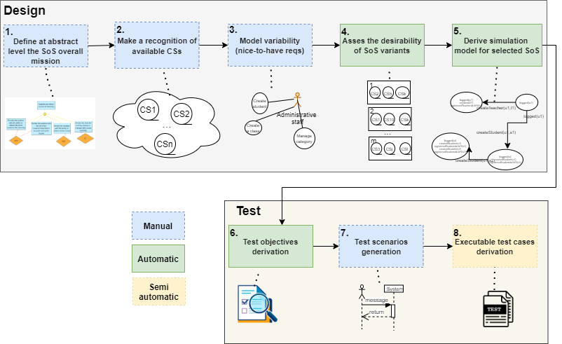
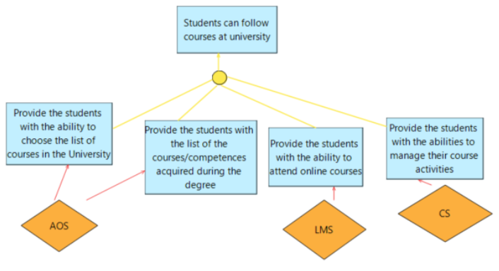
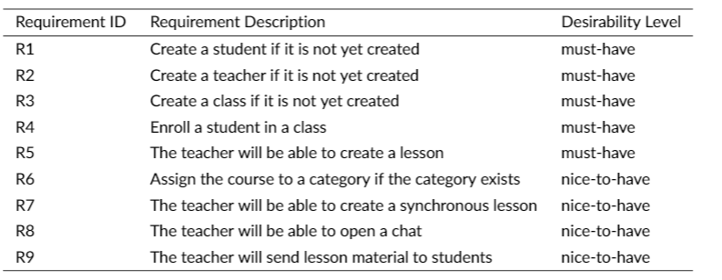
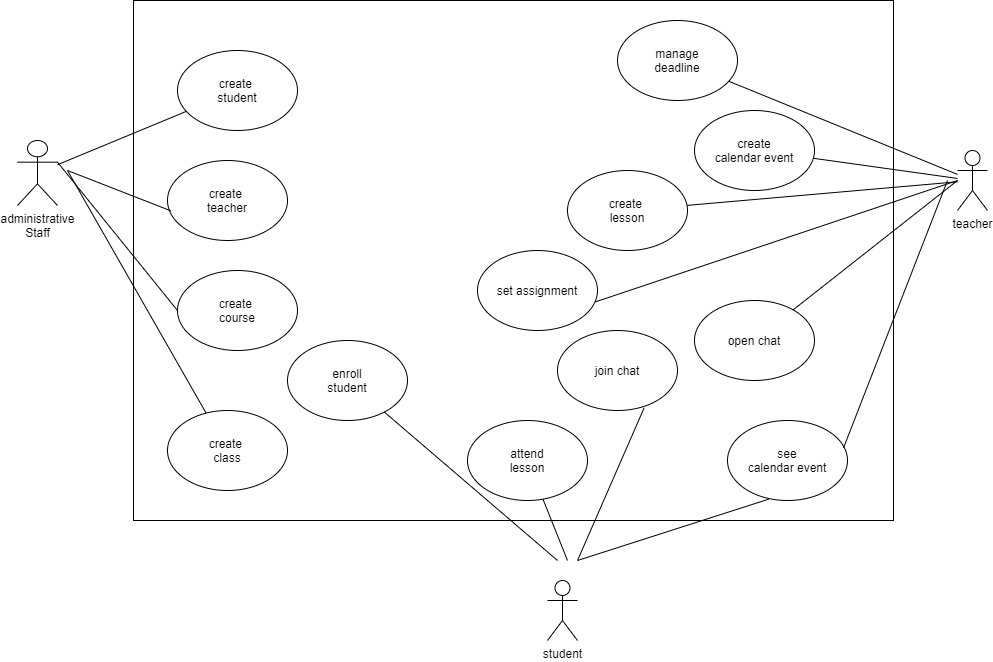
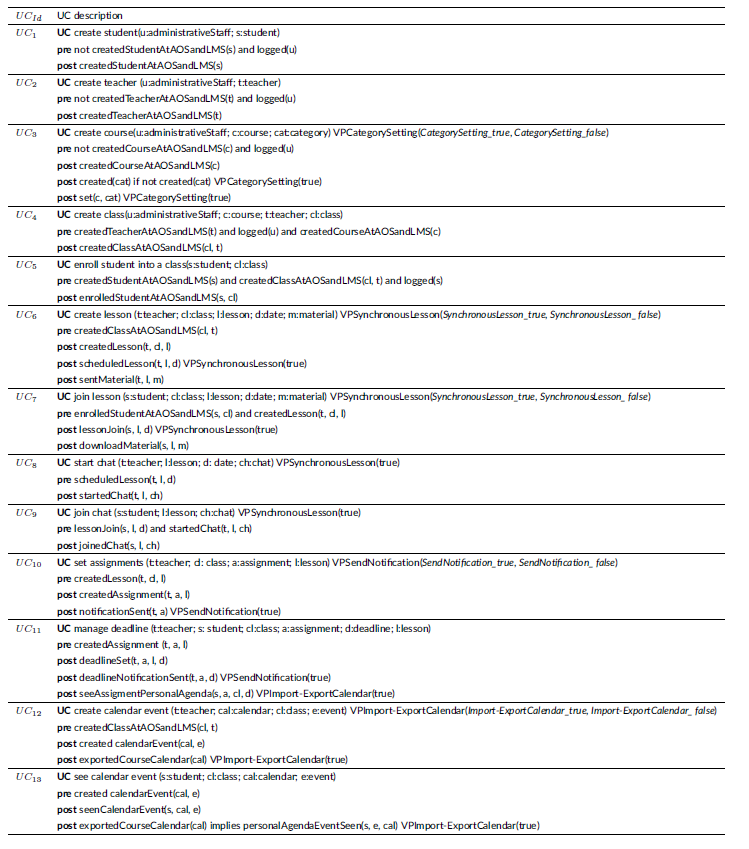
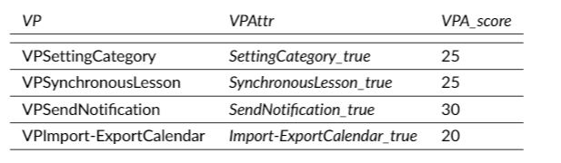
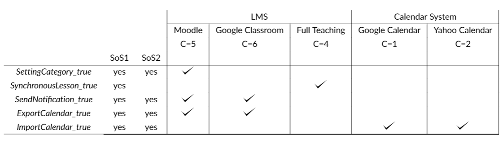
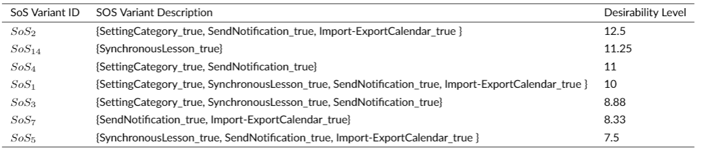

# About

This is the companion repository for the paper "Designing and Testing Systems of Systems: From Variability Models to Test Cases passing through Desirability Assessment".

# Approach

VANTES (VAriability aware-desigN and TEsting of SoS) is a methodology that provides a variability-aware-design and testing approach of SoSs, supporting the SoS engineer to assure that the SoS requirements are fulfilled and the SoS architecture can be easily maintained. The figure below presents an overview  of VANTESS. 

Follow, a step by step of our case study considering the Educational SoS. For more details, see in the paper.

## 1. Define at abstract level the SoS overall mission

Figure below presentes the overall mission diagram of Education SoS 

## 2. Make a recognition of available CSs

In the Educational SoS case study,  AOS was fixed and implemented by means of [RosarioSIS](https://www.rosariosis.org/), also available at our [EDUFYSOS repository](https://github.com/edufysos/rosariosis).

Concrete instances of LMS can be offered by [Moodle](https://moodle.org/), [FullTeaching](https://github.com/pabloFuente/full-teaching), and [Google Classroom](https://edu.google.com/products/classroom/) whereas CS could be implemented using [Google Calendar](https://developers.google.com/calendar) or [Yahoo Calendar](https://www.calendar.com/yahoo-calendar-gu-ide/}).

Leveraging the knowledge about the functionalities of these concrete CSs we reach in the following list of requirements:

## 3. Model variability (nice-to-have reqs)
Based on the list of the requirements, we modelled the use case diagram below:

 These use cases were enhanced with parameters, contracts, dependencies among use cases and variability points, as shown in the enhanced use case model:

 

## 4. Assess the desirability of SoS variants

We assigned a score for each variability of Education SoS, as shown below:

The table below shows for each CS type involved in the Educational SoS, the available CS instances identified during the CS recognition phase, along with their cost, estimated simply on a [1-10] scale.

include all 16 SoSs?

After computing the benefits and the expected cost of implement each SoS variant, we can calculate the desirability scores of the SoS variants, as shown below

include the desirability scores for all 16 SoSs?.

SoS 2 results to be the selected SoS variant since it has the highest desirability equal to 12.5. Moodle and Google Calendar are then chosen as reference implementations for LMS and CS respectively for the SoS 2 realisation.

## 5. Derive a simulation model for selected SoS

## 6. Test objectives derivation

## 7. Test scenarios generation

## 8. Test case generation

# Team

* Francesca Lonetti (CNR-ISTI) 
* Antonia Bertolino (CNR-ISTI)
* [Vânia de Oliveira Neves](https://github.com/vaniaon) (IC-UFF)

